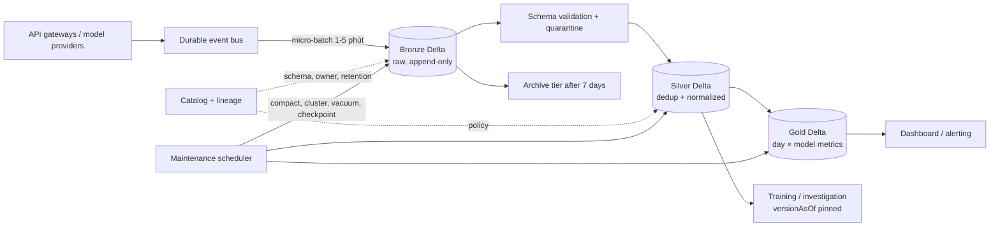

# Architecture Brief: LLM Observability at 1 Billion Requests/Day

## 1. Bài toán, SLO và giả định

Hệ thống thu thập log quan sát cho nhiều model LLM. Mỗi request có `request_id`, `timestamp`, `model_id`, token, latency, cost, mã lỗi và tham chiếu đến prompt/response. Prompt có dữ liệu nhạy cảm được token hóa hoặc tách khỏi bảng analytics trước khi ghi Silver.

| Ràng buộc | Giá trị thiết kế |
|---|---:|
| Lưu lượng | 1 tỷ request/ngày, trung bình 11.574 request/giây |
| Payload logic | 2 KB/request |
| Dữ liệu thô | 2 TB/ngày |
| Độ mới dashboard | ≤ 5 phút |
| Độ trễ truy vấn Gold p95 | ≤ 2 giây |
| RPO / RTO | 5 phút / 30 phút |
| Retention | Bronze hot 7 ngày, archive đến ngày 90; Silver 30 ngày; Gold 13 tháng |
| Ngân sách mục tiêu | ≤ 2.000 USD/tháng, chưa gồm egress và thuế |

Giá lưu trữ và query dưới đây là **giả định để design review**, không phải báo giá nhà cung cấp: Standard 0,023 USD/GB-tháng, archive 0,004 USD/GB-tháng và query 5 USD/TB scan. Trước triển khai phải thay bằng báo giá tại region thực tế.

## 2. Kiến trúc đề xuất

Bronze là nguồn replay bất biến theo nghiệp vụ; Silver chuẩn hóa và loại retry; Gold chứa p50/p95, error rate, token và cost theo `(date, model_id)`. Catalog là control plane cho schema, owner, retention và vị trí bảng. Job maintenance tách khỏi ingestion để không kéo dài commit quan trọng.

## 3. Năm quyết định và phương án bị loại

### Quyết định 1 — Medallion Bronze → Silver → Gold

**Chọn:** Bronze giữ payload gốc; Silver parse, kiểm tra schema và dedup theo `request_id`; Gold tiền tổng hợp cho dashboard.

**Phương án 1: ghi thẳng Gold.** Chi phí lưu thấp hơn nhưng mất khả năng replay, điều tra prompt lỗi và tính lại metric khi logic thay đổi.

**Phương án 2: Lambda architecture.** Batch và streaming độc lập có thể tối ưu riêng nhưng tạo hai implementation cho cùng logic, dễ lệch kết quả và tăng vận hành. Một pipeline micro-batch đáp ứng SLO 5 phút với ít bề mặt lỗi hơn.

### Quyết định 2 — Delta Lake làm table format chính

**Chọn:** Delta cung cấp transaction log, schema enforcement, MERGE, time travel/RESTORE và công cụ compaction phù hợp với stack của nhóm.

**Phương án 1: Apache Iceberg.** Iceberg mạnh về catalog đa engine, hidden partitioning và partition evolution. Nhóm sẽ chọn Iceberg nếu khả năng đọc đa engine quan trọng hơn workflow OPTIMIZE hiện có; MVP không dùng hai format để tránh hai bộ maintenance.

**Phương án 2: raw Parquet.** Đơn giản khi ghi một lần nhưng thiếu transaction log, snapshot và MERGE; reader có thể thấy tập file không nhất quán khi writer đang chạy.

### Quyết định 3 — Micro-batch 1–5 phút

**Chọn:** Event bus giữ buffer; writer gom đủ dữ liệu hoặc đủ thời gian rồi commit. Batch theo kích thước giúp hạn chế small files nhưng vẫn đạt độ mới dashboard.

**Phương án 1: commit từng request.** Độ trễ thấp nhất nhưng có thể tạo hàng triệu file và commit, làm metadata trở thành nút thắt.

**Phương án 2: batch theo giờ.** File lớn và rẻ hơn, nhưng không đạt SLO cảnh báo 5 phút và làm RPO xấu đi.

### Quyết định 4 — Partition theo ngày, cluster theo `model_id`

**Chọn:** Partition vật lý theo `date(timestamp)`; Z-order/cluster theo `model_id` và chỉ bổ sung `user_id` cho bảng điều tra có workload chứng minh nhu cầu. Query dashboard luôn có khoảng ngày và model nên có thể prune theo cả partition và min/max stats.

**Phương án 1: partition theo giờ.** Có ích cho xóa theo giờ nhưng tăng số partition và nguy cơ small files, đặc biệt với model ít traffic.

**Phương án 2: partition theo `model_id`.** Model mới tạo partition không kiểm soát; model có traffic lớn vẫn quá to. Clustering linh hoạt hơn vì không đưa cardinality nghiệp vụ vào cấu trúc thư mục.

**Phương án 3: không clustering.** Ghi nhanh hơn nhưng dashboard theo model phải quét toàn bộ partition ngày; chi phí scan tăng theo traffic.

### Quyết định 5 — Retention theo tầng và version pin

**Chọn:** Bronze ở Standard 7 ngày rồi archive đến ngày 90; Silver giữ 30 ngày; Gold giữ 13 tháng. Training hoặc điều tra ghi lại table version, code SHA và phạm vi ngày. VACUUM chỉ chạy sau khi kiểm tra version còn được các run tham chiếu.

**Phương án 1: giữ tất cả ở Standard.** Khôi phục nhanh nhưng chi phí tăng tuyến tính khoảng 24 TB logic/tháng trước compression và không phù hợp ngân sách.

**Phương án 2: xóa Bronze sau 7 ngày.** Rẻ nhất nhưng không thể replay sự cố muộn hoặc tính lại Silver khi parser sai.

**Phương án 3: external search/vector index là nguồn thật.** Query nhanh nhưng tạo lifecycle thứ hai; delete trong lakehouse có thể không truyền sang index. Nếu cần index, Change Data Feed phải chuyển cả upsert và delete, còn bảng vẫn là nguồn chuẩn.

## 4. Dung lượng và chi phí

### 4.1 Dung lượng

Payload logic mỗi ngày:

`1.000.000.000 × 2 KB = 2.000.000.000 KB ≈ 2 TB/ngày`.

Giả định Parquet nén Bronze còn 40% và Silver sau bỏ payload không cần thiết còn 0,35 TB/ngày:

| Lớp | Phép tính | Dung lượng |
|---|---:|---:|
| Bronze hot | 0,8 TB/ngày × 7 ngày | 5,6 TB |
| Bronze archive | 0,8 TB/ngày × 83 ngày | 66,4 TB |
| Silver | 0,35 TB/ngày × 30 ngày | 10,5 TB |
| Gold | Giả định tổng cộng | 0,05 TB |

### 4.2 Chi phí lưu trữ tháng

| Hạng mục | Phép tính | USD/tháng |
|---|---:|---:|
| Bronze hot | 5.600 GB × 0,023 | 128,80 |
| Bronze archive | 66.400 GB × 0,004 | 265,60 |
| Silver | 10.500 GB × 0,023 | 241,50 |
| Gold | 50 GB × 0,023 | 1,15 |
| **Tạm tính** | | **637,05** |
| Headroom 20% cho log, version và tăng trưởng | 637,05 × 20% | 127,41 |
| **Storage budget** | | **764,46** |

### 4.3 Chi phí compute theo scan

| Workload | Phép tính | USD/tháng |
|---|---:|---:|
| 10.000 dashboard query/ngày | 10.000 × 0,2 GB × 30 = 60 TB; × 5 USD/TB | 300,00 |
| Silver + maintenance | 1,15 TB/ngày × 30 × 5 | 172,50 |
| Gold refresh | 0,35 TB/ngày × 30 × 5 | 52,50 |
| **Tạm tính** | | **525,00** |
| Headroom 30% | 525 × 30% | 157,50 |
| **Compute budget** | | **682,50** |

Tổng thiết kế là `764,46 + 682,50 = 1.446,96 USD/tháng`, còn khoảng 553 USD dưới trần 2.000 USD cho request charges, catalog và cảnh báo. Nếu dashboard scan trung bình vượt 0,2 GB/query, hệ thống phải tăng mức tổng hợp Gold hoặc cache thay vì chỉ tăng ngân sách.

## 5. Maintenance và kiểm soát vận hành

- Theo dõi số file, kích thước p50 và số commit mỗi partition. Chạy compaction khi partition có trên 1.000 file hoặc kích thước p50 dưới 64 MB; mục tiêu file sau compact 256–512 MB.
- Cluster các partition Gold/Silver gần đây theo `model_id`; chỉ cluster lại khi pruning ratio hoặc query scan vượt ngưỡng.
- Giữ snapshot đủ dài hơn RPO và thời gian điều tra. Trước VACUUM, đối chiếu active training runs và readers đã pin version.
- Quét orphan bằng phép hiệu giữa file vật lý và file được snapshot/log tham chiếu. VACUUM không được giả định sẽ thấy file chưa từng commit.
- Tạo checkpoint Delta định kỳ để reader mới không phải replay lịch sử JSON quá dài.
- Ghi metric `rows_in`, `rows_out`, duplicates, quarantined rows, file count, bytes scanned và freshness cho mỗi run.

## 6. Failure modes, phát hiện và rollback

| Failure | Phát hiện | Giảm thiểu và rollback |
|---|---|---|
| Provider đổi schema hoặc kiểu dữ liệu | Tỷ lệ quarantine/null tăng; schema hash khác hợp đồng | Bronze vẫn nhận raw; Silver chặn field sai kiểu. Chỉ merge cột mới đã duyệt, sửa parser rồi replay từ version/date của Bronze. |
| Retry tạo duplicate | `count(*) - count(distinct request_id)` tăng | MERGE idempotent ở Silver. Rollback commit sai bằng RESTORE rồi chạy lại cùng batch ID. |
| Logic Gold sai | `p50 > p95`, error rate ngoài [0,1], chênh tổng token | Dừng publish, đọc Gold version trước qua time travel hoặc RESTORE; sửa code và tái tạo Gold từ Silver đã pin. |
| Small files hoặc maintenance chạy trùng writer | File count tăng, commit retry/latency tăng | Lease theo table/partition; compact partition đã đóng. Nếu job lỗi, giữ commit atomic và quét orphan sau retention guard. |
| Expiry/VACUUM làm mất version đang dùng | Run registry tham chiếu version sắp hết hạn | Preflight chặn maintenance; gia hạn retention. Nếu file đã xóa, phục hồi từ Bronze archive rồi tái tạo Silver/Gold, mục tiêu RTO 30 phút cho phạm vi gần. |
| External index không nhận delete | CDF offset trễ; audit thấy table 0 hit nhưng index >0 | Consumer CDF xử lý delete idempotent, lưu checkpoint. Khi lệch, dừng phục vụ subject bị ảnh hưởng và rebuild index từ version sạch. |

## 7. MVP một tuần

| Ngày | Kết quả |
|---|---|
| 1 | Sinh dữ liệu giả, tạo Bronze Delta, schema contract và metric ingest |
| 2 | Silver parse/dedup bằng `request_id`, quarantine schema sai |
| 3 | Gold theo ngày/model với p50, p95, error rate và cost |
| 4 | Benchmark partition + clustering; ghi file count và bytes scanned |
| 5 | Time travel/RESTORE, compaction, vacuum guard, orphan scan và checkpoint |
| 6 | Dashboard mẫu, alert freshness và test duplicate/schema drift |
| 7 | Chạy replay từ Bronze, đo acceptance criteria và viết runbook |

MVP dùng 1 triệu dòng/ngày để kiểm tra cơ chế trước khi scale. Tiêu chí chấp nhận:

1. Chạy lại cùng batch không tăng số dòng Silver.
2. Silver ít dòng hơn Bronze do retry được loại; quarantine giải thích được mọi dòng bị loại.
3. Gold có đủ 7 ngày × ít nhất 3 model, `p50 ≤ p95`, `cost_usd > 0`, `error_rate ∈ [0,1]`.
4. Dashboard Gold trả kết quả p95 dưới 2 giây trong môi trường thử nghiệm.
5. Compaction giảm ít nhất 10× số file và point query bỏ qua ít nhất 50% file.
6. Bơm một Gold commit sai, phát hiện bằng quality check, RESTORE và xác nhận số liệu trở lại baseline.
7. Tạo ba orphan giả, chứng minh VACUUM không thấy file chưa commit rồi quét sạch bằng orphan scanner.

Cơ chế khó nhất cần chứng minh là replay có kiểm soát: pin version Bronze, tạo Silver/Gold, ghi code SHA và row counts; sau khi có dữ liệu mới, đọc lại đúng version đã pin và xác nhận row count/checksum của đầu vào không đổi. Điều này kiểm tra trực tiếp time travel, provenance và rollback thay vì chỉ chứng minh pipeline chạy thành công.
